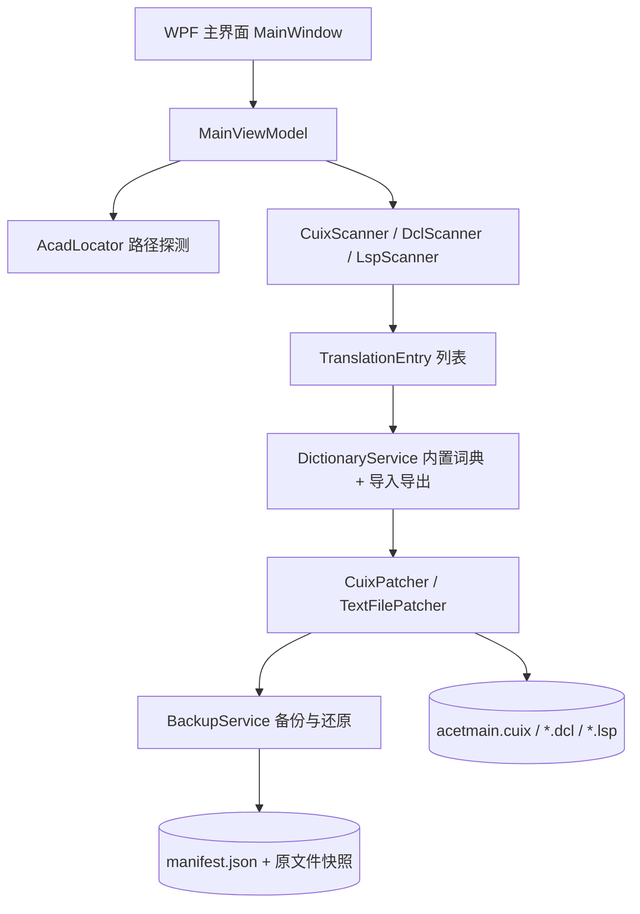

## 产品概述
一个 Windows 桌面工具，用于将 AutoCAD 2026 的 **Express Tools（快捷工具）** 从英文汉化为简体中文。AutoCAD 主程序及其他功能已是中文，本工具只针对 Express Tools。

## 核心功能
1. **自动定位**：自动探测 AutoCAD 2026 安装目录、Express 目录，以及实际生效的 `acetmain.cuix`（用户配置目录副本与 `UserDataCache` 源模板）；未找到时支持手动选择目录/版本。
2. **菜单与功能区汉化**：改写 `acetmain.cuix` 内的下拉菜单（PopMenuRoot）、功能区面板与按钮（RibbonRoot）、工具栏（ToolbarRoot）、命令名/说明/命令行提示（MenuGroup）。约 430 条字符串。
3. **对话框汉化**：改写 `Express\*.dcl` 中的 `label` / `text` / `title` 等显示文本，控件名、`key`、`action` 原样保留。
4. **命令提示汉化**：改写 `Express\*.lsp` 中 `prompt` / `princ` / `alert` / `getstring` / `getkword` / `initget` 等字符串字面量；`.fas` 等已编译加密文件跳过。
5. **内置离线词典**：程序内置全部英文原文的中文译文，完全离线工作；词典未覆盖的条目保留英文原文并单独列出。
6. **可编辑翻译表**：界面中以表格展示「原文 / 译文 / 来源文件 / 类型」，支持搜索、逐条编辑、启用/禁用单条、导出与导入（CSV / JSON）。
7. **备份与一键还原**：汉化前自动备份全部原文件并生成清单（时间、版本、文件、哈希），可随时完整还原；失败自动回滚。
8. **安全校验**：汉化前检测 AutoCAD 是否运行、目标文件是否被占用、是否需要管理员权限，并给出明确提示。

## 边界
- 不改动 AutoCAD 主程序、其他 CUIX、ARX/DLL 二进制资源。
- 不修改 `.fas`、`.arx`、`.dll`、`.lay`、`.dwg`。
- 不做在线翻译、不联网。


## 技术栈
- 语言/框架：**C# 12 + .NET 8（`net8.0-windows`）WPF**
- CUIX 处理：`System.IO.Compression.ZipFile`（实测 CUIX 即标准 ZIP/OPC 包）
- XML 处理：`System.Xml.Linq`（`XDocument`）
- JSON：`System.Text.Json`
- 编码：`System.Text.Encoding.CodePages`（注册 `CodePagesEncodingProvider` 以支持 GB18030）
- **不引入任何第三方 NuGet**，离线即可编译；轻量手写 MVVM（`INotifyPropertyChanged`），不使用 MVVM 框架

## 实现思路
程序按「扫描 → 查词典 → 打补丁 → 备份 → 写回 → 可还原」的流水线工作：

1. **扫描**：`AcadLocator` 给出目标文件清单；`CuixScanner` 解压 CUIX 提取可汉化节点，`.dcl/.lsp` 用规则扫描器提取字符串字面量。
2. **匹配**：`DictionaryService` 以「原文 + 类型 + 来源」为键查内置词典，未命中则标记为 `Untranslated` 并保留英文。
3. **打补丁**：`CuixPatcher` 只替换 `<Name>`、`<HelpString>`、`<CLICommand>` 及各节点的 `DisplayName` 等**显示文本**；`<Command>`、图片资源名、`UID`（如 `XLS_0034`）、`<ToolTip HelpTopic>` 全部原样保留。重打包时逐条复制 ZIP 条目，确保 `[Content_Types].xml`、`_rels/.rels`、`Header.cui`、`Menu_Package_Info.xml` 与图片资源零丢失。
4. **备份还原**：`BackupService` 先快照到 `<备份根>\<时间戳>\`，写 `manifest.json`；任一文件写入失败即回滚该文件，整体异常时提示可一键还原。

关键取舍：
- **直接改用户配置目录的 CUIX 优先**（`%APPDATA%\Autodesk\AutoCAD 2026\R26.x\<lang>\Support\acetmain.cuix`），无需管理员权限且立即生效；`UserDataCache` 源模板作为可选项（需提权，影响新建用户配置）。
- **编码默认 GB18030**（代码页 936），与实测的 ANSI DCL/LSP 一致，保证 AutoCAD 正确读取；CUIX 内部 XML 用 UTF-8。提供 UTF-8(BOM) 开关应对个别环境。
- **.fas 不可改**：`acetutil*.fas` 为编译加密文件，直接跳过，其功能对应的命令名与提示仍可通过 CUIX/LSP/DCL 覆盖。
- **`xlate="true"` 兜底**：若实测发现 AutoCAD 通过 `xlate="true"` + `UID="XLS_xxxx"` 走资源 DLL 查找而覆盖写入文本，则提供「强制本地化」开关将这些节点 `xlate` 置为 `false`。

## 执行要点（防回归）
- 汉化前必须检测 `acad.exe` 进程与目标文件占用，占用则中止并提示关闭 AutoCAD。
- 词典型匹配区分 `Menu` / `Ribbon` / `Toolbar` / `HelpString` / `DclLabel` / `LspPrompt`，避免同一英文在不同语境下被误译。
- 写入前逐文件比对哈希，内容无变化则跳过，减少无谓写入。
- 备份目录按时间戳隔离，不做覆盖；还原时校验 manifest 后再写回。
- 日志写入 `logs\` 并实时输出到界面，不记录用户文件全量内容。

## 架构设计



- `CAD_ET_HANS.Core`：纯逻辑，无 UI 依赖，可被抽取工具与未来 CLI 复用（SoC/DIP）。
- `CAD_ET_HANS.App`：只负责展示与交互。
- `CAD_ET_HANS.Extract`：开发期一次性工具，从真实文件抽取全部原文生成词典骨架。

## 目录结构

```
d:\code\CAD_ET_HANS\
├── CAD_ET_HANS.sln                          # [NEW] 解决方案，含 Core / App / Extract 三个项目
├── README.md                                # [NEW] 使用说明：自动定位规则、备份还原、词典导入导出、已知限制
├── src\
│   ├── CAD_ET_HANS.Core\                    # [NEW] net8.0 类库，全部业务逻辑
│   │   ├── CAD_ET_HANS.Core.csproj
│   │   ├── Models\
│   │   │   ├── TranslationEntry.cs          # [NEW] 条目模型：原文/译文/类型/来源文件/状态/是否启用
│   │   │   ├── TranslateTarget.cs           # [NEW] 目标文件描述与版本/语言信息
│   │   │   └── BackupManifest.cs            # [NEW] 备份清单模型
│   │   ├── Services\
│   │   │   ├── AcadLocator.cs               # [NEW] 注册表+目录探测 AutoCAD 2026/2027 安装路径、Express 目录、CUIX 候选路径、语言子目录
│   │   │   ├── CuixPatcher.cs               # [NEW] CUIX 解压/选择性替换/无损重打包，保留 OPC 元数据与图片资源
│   │   │   ├── TextFilePatcher.cs           # [NEW] DCL(label/text/title) 与 LSP(prompt/princ/alert/getstring/getkword/initget) 规则化替换，可配编码
│   │   │   ├── DictionaryService.cs         # [NEW] 内置词典加载、查词、合并用户覆盖、导入导出 CSV/JSON
│   │   │   ├── BackupService.cs             # [NEW] 快照备份、manifest 生成、校验还原、单文件回滚
│   │   │   └── FileLockHelper.cs            # [NEW] 进程检测(acad.exe)与文件占用检测
│   │   └── Resources\
│   │       └── dictionary.json              # [NEW] 内置离线词典（EmbeddedResource），分批生成：CUIX → DCL → LSP
│   └── CAD_ET_HANS.App\                     # [NEW] net8.0-windows WPF 应用
│       ├── CAD_ET_HANS.App.csproj
│       ├── App.xaml / App.xaml.cs
│       ├── Views\
│       │   ├── MainWindow.xaml(.cs)         # [NEW] 主窗口：路径区、范围开关、翻译表、进度与日志、操作按钮
│       │   └── Styles.xaml                  # [NEW] 全局样式与主题资源
│       ├── ViewModels\
│       │   ├── MainViewModel.cs             # [NEW] 扫描/汉化/还原/导入导出命令与进度状态
│       │   └── RelayCommand.cs              # [NEW] 轻量命令实现
│       └── Converters\
│           └── StatusToBrushConverter.cs    # [NEW] 翻译状态到颜色的转换
└── tools\
    └── CAD_ET_HANS.Extract\                 # [NEW] net8.0 控制台，开发期抽取全部英文原文生成词典骨架
        ├── CAD_ET_HANS.Extract.csproj
        └── Program.cs
```

## 关键代码结构

```csharp
// Models/TranslationEntry.cs —— 贯穿扫描、词典、补丁、UI 的核心数据结构
public enum EntryKind { MenuItem, RibbonItem, ToolbarItem, CommandName, HelpString, DclLabel, LspPrompt }

public sealed class TranslationEntry
{
    public string Source      { get; init; } = "";   // 英文原文
    public string Target      { get; set;  } = "";   // 中文译文（可编辑）
    public EntryKind Kind     { get; init; }
    public string OriginFile  { get; init; } = "";   // 来源：MenuGroup.cui / tcase.dcl / tcase.lsp
    public bool Enabled       { get; set;  } = true;
    public bool Translated    { get; }               // Target 非空且非原文
}
```

```csharp
// Services/CuixPatcher.cs —— 无损重打包契约
public interface ICuixPatcher
{
    // 读取 CUIX，返回可被词典匹配的显示文本条目（不修改磁盘文件）
    IReadOnlyList<TranslationEntry> Scan(string cuixPath);

    // 按已启用且已翻译的条目改写 CUIX；autoBackup 为 true 时先快照
    PatchResult Apply(string cuixPath, IReadOnlyList<TranslationEntry> entries,
                      bool autoBackup, bool forceLocalize);
}
```


## 设计风格
采用 **Fluent Design（微软 fluent 2 风格）**：浅色亚克力质感、柔和阴影与圆角、清晰层级。整体为专业工具类软件的克制风格，不使用花哨装饰，保证长时间校对翻译表时不疲劳。

## 页面规划（单窗口多区块）
1. **顶部标题栏**：产品名「AutoCAD Express Tools 汉化工具」+ 版本徽标。
2. **环境检测区**：显示检测到的 AutoCAD 版本、安装路径、Express 目录、生效的 CUIX 路径与语言；右侧「重新检测」「手动选择」按钮；状态用绿/黄/红指示。
3. **汉化范围区**：三个带说明的开关（菜单与功能区 CUIX / 对话框 DCL / 命令提示 LSP），外加编码选择（GB18030 默认 / UTF-8）、强制本地化开关、备份目录显示与「打开备份目录」。
4. **翻译表区（主区）**：可编辑表格，列含 类型、原文、译文、来源文件、状态；支持搜索过滤、状态筛选（全部/已翻译/未翻译）、单条启用勾选、双击编辑；右上「导出」「导入」。
5. **底部操作与日志区**：进度条 + 当前文件进度文本 + 日志输出框；按钮「开始汉化」「一键还原」「退出」，危险操作二次确认。

## 交互细节
- 表格行按状态着色：已翻译（中性）、未翻译（琥珀色）、已禁用（灰显）。
- 汉化过程中按钮禁用并实时刷新进度，完成后弹出结果摘要（成功/跳过/失败数）。
- 危险操作（覆盖 Program Files 文件、还原）均需确认对话框。
- 窗口最小宽度 960，表格区自适应，支持列宽记忆。

## Agent Extensions
### SubAgent
- **code-explorer**
  - Purpose：批量扫描 `C:\Program Files\Autodesk\AutoCAD 2026\Express\` 下的 `.dcl` / `.lsp` 文件与 CUIX 内部结构，统计可汉化字符串分布，为词典生成与解析器规则提供依据
  - Expected outcome：得到按文件/类型分类的英文原文清单，确保抽取脚本与内置词典不漏项

### Skill
- **lsp-code-analysis**
  - Purpose：在 Core / App / Extract 项目成型后校验 C# 符号定义与引用（接口实现、服务调用链），确保编译前无悬空引用
  - Expected outcome：三个项目类型引用完整、接口与实现一致，首次编译即通过
